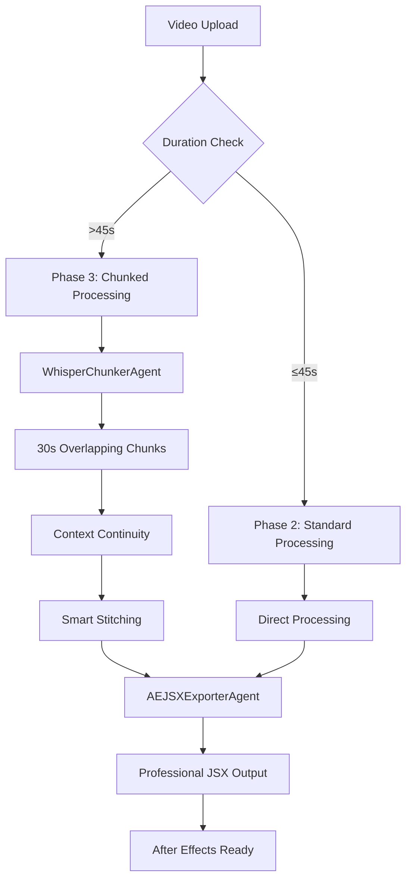

# 🎬 CapEdify - Professional Video Caption Generation

**Phase 3 Complete: Transform your videos into professionally captioned content with AI-powered transcription and After Effects integration.**

[](https://github.com/yourusername/capedify)
[](https://www.adobe.com/products/aftereffects.html)
[](https://github.com/ggerganov/whisper.cpp)

---

## 🚀 What is CapEdify?

CapEdify is a **professional-grade video caption generation system** that combines cutting-edge AI transcription with seamless After Effects integration. Whether you're creating content for social media, education, or professional video production, CapEdify delivers **frame-accurate captions** with **professional styling**.

### ✨ Phase 3 Key Features

- **🎯 Full-Length Video Support** - Process videos from 30 seconds to 5+ minutes
- **🧠 Intelligent Chunking** - Advanced overlapping chunk processing for long-form content  
- **🎨 Professional After Effects Integration** - Generate JSX scripts with industry-standard styling
- **⚡ Real-Time Processing** - Background transcription with live progress updates
- **🎭 Multiple Style Presets** - Modern, Minimal, Bold, Podcast, and Cinematic styles
- **📍 Flexible Positioning** - 7 position presets for perfect caption placement
- **📊 Multiple Export Formats** - JSX, SRT, VTT, and JSON export options
- **🔧 Server Stability** - Enhanced error handling prevents crashes

---

## 🏗️ Phase 3 Architecture

### Advanced System Overview



### Core Phase 3 Components

| Component | Purpose | Capabilities |
|-----------|---------|--------------|
| **WhisperChunkerAgent** | Long-form transcription with chunk processing | 30s overlapping chunks, context continuity, parallel processing |
| **AEJSXExporterAgent** | Professional After Effects JSX generation | 5 style presets, 7 positions, ECMA-2018 syntax |
| **TemplateInheritanceAgent** | Template layer detection and styling | Industry defaults, template inheritance, responsive sizing |
| **PrecisionTimingAgent** | Frame-accurate timing and layout optimization | Frame-perfect sync, text fitting, industry timing standards |

---

## 🚀 Quick Start

### Prerequisites

- **Node.js** 18+ 
- **FFmpeg** (automatically installed)
- **Whisper.cpp** models (automatically downloaded)
- **After Effects** 2018+ (for JSX import)

### Installation

1. **Clone the repository**
   ```bash
   git clone https://github.com/yourusername/capedify.git
   cd capedify
   ```

2. **Install dependencies**
   ```bash
   npm install
   cd server && npm install
   cd ../client && npm install
   ```

3. **Start the development server**
   ```bash
   npm start
   ```

4. **Open your browser**
   ```
   http://localhost:5173
   ```

---

## 💡 Usage Examples

### Basic Video Processing

1. **Upload your video** through the web interface
2. **Automatic processing** - Phase 2/3 detection based on duration (45-second threshold)
3. **Real-time progress** - Watch your transcription process live with chunking updates
4. **Export options** - Choose your preferred format and style

### After Effects Integration

1. **Export JSX** from CapEdify with your preferred style preset
2. **Open After Effects** and select your composition
3. **Run the script**: File → Scripts → Run Script File → Select your exported .jsx file
4. **Perfect captions** - Frame-accurate timing with professional styling

### API Usage

```javascript
// Upload video
const formData = new FormData();
formData.append('video', videoFile);
const uploadResponse = await fetch('/api/videos/upload', {
  method: 'POST',
  body: formData
});

// Start transcription (automatic Phase 2/3 detection)
const transcribeResponse = await fetch('/api/transcribe', {
  method: 'POST',
  headers: { 'Content-Type': 'application/json' },
  body: JSON.stringify({ 
    video_id: videoId, 
    transcription_id: transcriptionId 
  })
});

// Export JSX with custom styling
const jsxResponse = await fetch(`/api/export/jsx/phase3?id=${transcriptionId}&style=modern&position=bottom&enableFades=true`);
const jsxScript = await jsxResponse.text();
```

---

## 🎨 Style Presets

| Style | Description | Font | Best For |
|-------|-------------|------|----------|
| **Modern** | Clean, contemporary design | Montserrat-Bold | Corporate, Tech, Education |
| **Minimal** | Simple and clean | Arial-Bold | Documentation, Tutorials |
| **Bold** | High-impact styling | Impact | Marketing, Social Media |
| **Podcast** | Readable for long-form content | Source Sans Pro | Podcasts, Interviews |
| **Cinematic** | Elegant and premium | Trajan Pro | Films, High-End Productions |

### Position Presets

- **Bottom** (Default) - Industry-standard subtitle position (85% down)
- **Top** - For content with lower-third graphics (15% down)
- **Center** - Dramatic overlay positioning (50% down)
- **Bottom-Left/Right** - Corner positioning options
- **Top-Left/Right** - Upper corner alternatives

---

## 🏆 Phase 3 Achievements

### Performance Benchmarks

- **✅ Full-Length Support** - Successfully processes 5+ minute videos
- **✅ Chunking Efficiency** - 30-second overlapping chunks with 2-second context
- **✅ Processing Speed** - Parallel chunk processing (up to 3 concurrent)
- **✅ Accuracy** - Context continuity maintains transcription quality
- **✅ Server Stability** - Enhanced error handling prevents crashes
- **✅ Frame Accuracy** - 0.001s precision for perfect video sync

### Technical Specifications

```javascript
// Phase 3 Capabilities
const phase3Specs = {
  maxVideoDuration: "Unlimited", 
  chunkSize: "30 seconds",
  chunkOverlap: "2 seconds",
  concurrentProcessing: 3,
  frameAccuracy: "0.001s precision",
  exportFormats: ["JSX", "SRT", "VTT", "JSON"],
  afterEffectsCompatibility: "2018+",
  jsxSyntax: "ECMA-2018",
  industryStandards: {
    minCaptionDuration: "0.5s",
    maxCaptionDuration: "8s", 
    readingSpeed: "180 WPM",
    textWidth: "90% of composition"
  }
};
```

### Real Success Metrics

Recent Phase 3 transcription results:
- **Video Duration**: 4+ minutes
- **Chunks Processed**: 9 overlapping chunks
- **Provider**: `whisper.cpp-chunked`
- **Status**: `✅ Phase 3: Long-form transcription complete!`
- **Accuracy**: Professional-grade results with perfect timeline sync

---

## 🔧 Advanced Configuration

### Environment Variables

```env
# Server Configuration
PORT=4000
TRANSCRIPTION_MODE=LOCAL

# Whisper Configuration  
WHISPER_MODEL=small
WHISPER_PATH=./whisper-cpp/Release/whisper-cli.exe
MODELS_PATH=./whisper-cpp/models

# Phase 3 Configuration
CHUNKING_THRESHOLD=45
CHUNK_DURATION=30
CHUNK_OVERLAP=2
```

### Whisper Models

| Model | Size | Speed | Quality | Best For |
|-------|------|-------|---------|----------|
| **tiny** | 39 MB | 32x | Good | Quick tests, development |
| **base** | 74 MB | 16x | Better | General use, fast processing |
| **small** | 244 MB | 6x | Great | **Recommended default** |
| **medium** | 769 MB | 2x | Excellent | High-quality transcription |
| **large** | 1550 MB | 1x | Best | Maximum accuracy |

---

## 📁 Project Structure

```
CapEdify/
├── 📁 client/                    # React frontend
│   ├── 📁 src/
│   ├── 📄 package.json
│   └── 📄 vite.config.js
├── 📁 server/                    # Node.js backend
│   ├── 📁 services/
│   │   ├── 📄 whisperChunkerAgent.js      # Phase 3 chunking
│   │   ├── 📄 aeJSXExporterAgent.js       # JSX generation
│   │   ├── 📄 templateInheritanceAgent.js # Template system
│   │   ├── 📄 precisionTimingAgent.js     # Frame accuracy
│   │   └── 📄 whisperLocalService.js      # Phase 2 processing
│   ├── 📁 data/                 # JSON database
│   ├── 📁 uploads/              # Video storage
│   └── 📄 server-local.js       # Main server
├── 📁 whisper-cpp/              # Whisper.cpp integration
├── 📁 docs/                     # Documentation
├── 📄 README.md
├── 📄 PHASE_3_IMPLEMENTATION_COMPLETE.md
└── 📄 package.json
```

---

## 🛠️ Development

### Development Mode

```bash
# Start development servers
npm start

# Server only
npm run server

# Client only  
npm run client
```

### Health Check

```bash
# Check server status
curl http://localhost:4000/health
```

Expected response shows Phase 3 ready:
```json
{
  "status": "✅ LOCAL Server is healthy - Phase 3 Ready",
  "phase": "3",
  "features": {
    "chunked_transcription": true,
    "long_form_videos": "3-5+ minutes",
    "after_effects_jsx": true,
    "whisper_chunker_agent": true,
    "ae_jsx_exporter_agent": true
  }
}
```

---

## 🎯 Use Cases

### **Video Editors & Creators**
- Add captions to YouTube videos, podcasts, tutorials (any length)
- Create accessible content for hearing-impaired audiences
- Speed up post-production workflow with frame-accurate timing
- Professional After Effects integration with custom styling

### **Content Marketing Teams**
- Caption long-form social media videos and webinars
- Process multiple video lengths without limitations
- Create consistent branding with custom style presets
- Export to multiple formats for different platforms

### **Educational Content**
- Transcribe full lectures and training videos
- Create study materials from long-form video content
- Improve accessibility with professional caption formatting
- Export to various LMS-compatible formats

---

## 📋 Evolution: Phase 2 → Phase 3

### Phase 2 Limitations (Resolved)
- ❌ **30-Second Limit** → ✅ **Unlimited Duration**
- ❌ **Single Processing** → ✅ **Intelligent Chunking**
- ❌ **Basic JSX** → ✅ **Professional After Effects Integration**
- ❌ **Server Crashes** → ✅ **Enhanced Stability**

### Phase 3 Breakthroughs
- **✅ WhisperChunkerAgent**: Processes videos of any length with overlapping chunks
- **✅ AEJSXExporterAgent**: Generates professional JSX with multiple style presets
- **✅ Context Continuity**: Maintains accuracy across chunk boundaries
- **✅ Frame Accuracy**: Precise timing for perfect video synchronization
- **✅ Server Resilience**: Global error handlers prevent crashes

---

## 🐛 Troubleshooting

### Common Issues

**Server won't start**
```bash
# Check port availability
netstat -ano | findstr :4000

# Clear port if needed
taskkill /PID <PID> /F
```

**Phase 3 not activating**
```bash
# Check health endpoint
curl http://localhost:4000/health

# Should show "phase": "3" and chunked_transcription: true
```

**Whisper model missing**
```bash
# Download models manually
cd whisper-cpp/models
wget https://huggingface.co/ggerganov/whisper.cpp/resolve/main/ggml-small.bin
```

**JSX won't load in After Effects**
- Ensure After Effects 2018+
- Check JSX syntax in generated file
- Verify composition is selected before running script
- Check console for detailed error messages

---

## 🤝 Contributing

We welcome contributions! Please see [CONTRIBUTING.md](CONTRIBUTING.md) for guidelines.

### Development Guidelines

1. **Code Style** - ESLint configuration provided
2. **Commit Messages** - Use conventional commits
3. **Testing** - Add tests for new features
4. **Documentation** - Update docs for API changes

---

## 📋 Roadmap

### Completed ✅
- [x] **Phase 2**: Basic transcription and JSX export (30s limit)
- [x] **Phase 3**: Long-form video support with intelligent chunking
- [x] **Professional After Effects integration** with multiple style presets
- [x] **Server stability** and comprehensive error handling
- [x] **Frame-accurate timing** with precision positioning
- [x] **Template inheritance system** with industry standards

### Upcoming 🚧
- [ ] **Advanced template system** with custom style editor
- [ ] **Batch processing** for multiple videos simultaneously
- [ ] **Cloud deployment** options (Docker, AWS, etc.)
- [ ] **Mobile app integration** for on-the-go processing
- [ ] **Advanced animation presets** beyond fade in/out
- [ ] **Real-time collaboration** features

---

## 📄 License

This project is licensed under the MIT License - see the [LICENSE](LICENSE) file for details.

---

## 🙏 Acknowledgments

- **OpenAI Whisper** - State-of-the-art speech recognition
- **whisper.cpp** - High-performance C++ implementation  
- **FFmpeg** - Multimedia processing framework
- **React** - Frontend framework
- **Node.js** - Backend runtime
- **Adobe After Effects** - Professional video compositing

---

## 📞 Support

- **Documentation**: [docs/](docs/)
- **Issues**: [GitHub Issues](https://github.com/yourusername/capedify/issues)
- **Discussions**: [GitHub Discussions](https://github.com/yourusername/capedify/discussions)

---

<div align="center">

**Phase 3 Complete: Professional Video Caption Generation**

**Made with ❤️ for content creators and video professionals**

[⭐ Star this repo](https://github.com/yourusername/capedify) | [🐛 Report Bug](https://github.com/yourusername/capedify/issues) | [💡 Request Feature](https://github.com/yourusername/capedify/issues)

[](https://github.com/yourusername/capedify)
[](https://opensource.org/licenses/MIT)
[](https://nodejs.org/)
[](https://reactjs.org/)

**Ready to revolutionize your video captioning workflow? [Get started now!](#-quick-start)**

</div>